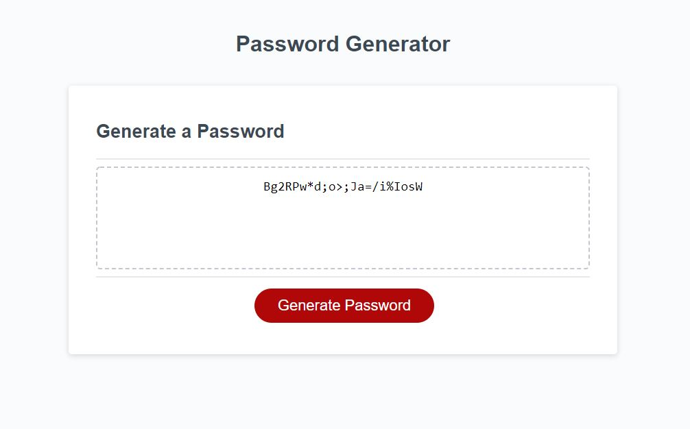

# javascript-password-generator

## Table of Contents:

- [Description](#description)
- [Usage](#usage)
- [Visuals](#visuals)
- [Resources](#resources)
- [Authors & Acknowledgement](#authors-and-acknowledgement)

## Description:

This website allows users to generate a random password for their accounts.

## Usage:

A user is able to click the generate password button to begin.

A user is able to enter a character length for their password between 8 and 128 characters.

A user is able to choose to include uppercase, lowercase, special characters, and numbers to include in their randomly generated password.

A user is then presented with their randomly generated password.

## Visuals:

## Resources:

[GitHub Repo](https://github.com/HarrisonHayes/javascript-password-generator)

[Live Deployment]()

## Authors & Acknoledgement:

Harrison Hayes